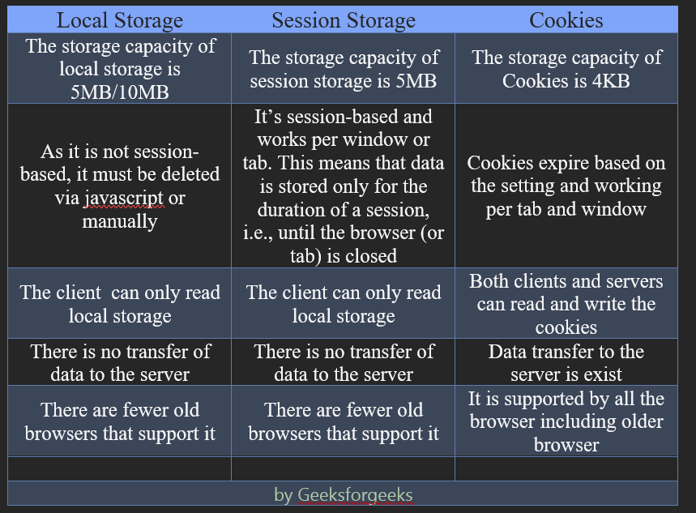

# HTML & CSS Interview Questions

## Topics

## HTML
- [Q1. What is HTML ? ](#what-is-html)
- [Q2. What is the difference between HTML elements and tags? ](#difference-between-HTML-elements-and-tags)

- [Q3. What is the difference between a block-level element and an inline element? ](#difference-between-a-block-level-element-and-an-inline-element)

- [Q4. How to create a nested webpage in HTML?](#create-a-nested-webpage-in-html)


- [Q5. What are the new HTML5 elements?](#new-html5-elements)

- [Q6. What is Cell Spacing and Cell Padding?](#cell-spacing-and-cell-padding)

- [Q7. Logical vs Physical Tags](#logical-vs-physical-tags)

- [Q8. Colspan and Rowspan](#colspan-and-rowspan)

- [Q9. New Features of HTML5?](#new-features-of-html5)

- [Q10. Application cache](#application-cache)

- [Q11. Local storage vs session storage vs cookies](#local-storage-vs-session-storage-vs-cookies)

- [Q12. Viewport](#viewport)

- [Q13. Meta Tag](#meta-tag)

- [Q14. SVG and Canvas](#svg-and-canvas)

- [Q15. Geolocation in HTML5](#geolocation-in-html5)

- [Q16. Doctype](#doctype)

- [Q17. New input types in HTML5](#new-input-types-in-html5)

- [Q18. Semantic elements in HTML5](#semantic-elements-in-html5)

- [Q19. Key global attributes in HTML5](#key-global-attributes-in-html5)

- [20. Web Workers API in HTML5](#web-workers-api-in-html5)


---
## CSS
- - [Q1. New features of CSS3  ](#)


---

## What is HTML
[Topics](#topics)

- Stands for HyperText Markup Language.
- A standard text formatting language used in web development for creating web pages.
- Browser is its interpreter and HTML instructs the browser what and how to display.


## Difference between HTML elements and tags
[Topics](#topics)

| HTML Tags | HTML Elements |
| ------------- | --------- |
| These are the starting and ending parts of the HTML elements.  | These are the combinations of the starting tag, the content, and the ending tag. |
| Or these are the building blocks of an HTML element. | Or these are the building blocks of the HTML document. |
| For example, ``` <b>, <p>, </b> , </div>,  etc. ``` | For example, ``` <p> Hello </p> ``` |

### HTML Attribute: 
- It helps in defining the characteristics of the HTML elements. It is present only in the starting tag. The common attribute that is used for styling the element is “Style” attribute.
```html


Here,  is the tag.
src, alt, and style are the attributes.
The whole thing is an HTML image element.

```

## Difference between a block-level element and an inline element
[Topics](#topics)

| Block Level Element | Inline Element |
| -------- | -------- |
| Always starts on a new line. | It doesn’t and be in a line |
| It takes the full width. | It only takes the space as per its requirement. |
| For example, ``` <p> ,<div>, <address>, <article>, <canvas>, <h1>-<h6>, <hr>, <li>, <ol>, <ul>, <pre>, <video>, <table>, <form>, <fieldset>, <noscript>, etc.  ``` | For example, ``` <span>, <a>, <b>, <br>, <button>, <i>, , <input>, <label>, <script>, <select>, <small>, <strong>, <sub>, <sup>, <textarea>, etc.  ``` |


## Create a nested webpage in HTML?
[Topics](#topics)

- The "iframe" and the "embed" tag help in displaying the nested webpage in two different ways.
- iframe: It defines an inline	frame (includes scroll bar and border) within the browser for displaying the other website.
```
<iframe src=”http://www.myWebsite.abc” height=”100px” width=”80px”> </iframe>
```

- embed: Mostly, it is used for including other videos or audios on website. It also can be used for nesting the website.
```
<embed src=”https://www.myWebsite.abc” type=”text/html” />
```

## New HTML5 Elements
[Topics](#topics)

- The following are the new HTML5 Elements.
```
<article>, <aside>, <header>, <footer>, <audio>, <video>, <datalist>, <details>, <embed>, <figure>, <hgroup>, <mark> For highlighting the text</mark>, <meter>,<nav>, <output>, <progress>, <time>
```
- The ```<canvas>``` tag is used to draw the graphics on the web page with the help of JavaScript. It does not have border and text.


## Cell Spacing and Cell Padding
[Topics](#topics)

- Cell spacing: Space between the cells. (Space outside the cell)
- Cell Padding: Space between the cell border and the content. (Space inside the cell)
For example,
```html
<table border=”2” cellspacing=”4” cellpadding=”6” > </table>
```


## Logical vs Physical tags
[Topics](#topics)


## Colspan and Rowspan
[Topics](#topics)

- Colspan: To make a cell of a table span over multiple columns (Merge columns into a single column).
- Rowspan: To make a cell of a table span over multiple rows (Merge rows into a single row)  


## New features of HTML5?
[Topics](#topics)

- Storage: Web storage (session and local), application cache, and web SQL DB. 
- Semantics tags: Readable tags such as ``` <header>, <footer>,<figure>,<aside>, <section>, <article>, etc. ```
- Audio & Video tags for embedding multimedia on website.
- Vector graphics: The ```<svg>``` tag is used for drawing graphics that contain features such as scalable, easy to create and update, supports interactivity and animation, and light weight,.
- Progress tag: Used for displaying progress bar.
- Placeholder attribute: Describes the short hint inside the input field or text area that vanishes when the user starts typing or clicks on the input field.


## Application cache
[Topics](#topics)

- Application cache: It allows the web application to be cached so that can be accessible without an internet.

#### Advantages:
- Offline browsing: The web page can be accessed offline.
- Speed: The cached resources load faster.
- Resilience: The users of the website will enjoy it offline if the site goes down for maintenance.

#### NOTE: It is being removed from web platform. It is deprecated and non-standard.


## local storage vs session storage vs cookies
[Topics](#topics)




## viewport
[Topics](#topics)

- It is the area of the browser window in which the web content can be visible to the user. 
- It varies with the devices and smaller on the mobile device.
- The viewport can be set using meta tag. It instructs the browsers how to control the page’s dimensions and scaling. Initial-scale sets the initial zoom level when the page is first loaded. 

```html
<meta name=”viewport” content=”width=device-width, initial-scale=1.0”>
```


## META tag
[Topics](#topics)

- It describes metadata (information about data) within the HTML elements. 
- It provides the information about the HTML document such as expiry date, author name, keywords, and description. It also helps in SEO.

```html
<head>
  <meta charset="UTF-8">
  <meta name="description" content="Free Web tutorials">
  <meta name="keywords" content="HTML, CSS, JavaScript">
  <meta name="author" content="John Doe">
  <meta name="viewport" content="width=device-width, initial-scale=1.0">
</head>

```


## SVG and Canvas
[Topics](#topics)


## Geolocation in HTML5
[Topics](#topics)

- used to share the location with some websites and be aware of the exact location. It is used for showing locations on the map.
- Examples 1: The getCurrentPosition returns the users current position.
```html
var loc = navigator.geolocation;
function getLoc() {
loc.getCurrentPosition(showLoc, errHand);
}

```

- Example 2. Displaying the current location using latitude and longitude via HTML Geolocation.

```html
<body>
   
<p>Displaying location using Latitude and Longitude</p>
 
  <button class="geeks" onclick="getlocation()">
    Click Me
  </button>
  <p id="demo1"></p>
 
  <script>
    var variable1 = document.getElementById("demo1");
    function getlocation() {
      navigator.geolocation.getCurrentPosition(showLoc);
    }
    function showLoc(pos) {
      variable1.innerHTML =
        "Latitude: " +
        pos.coords.latitude +
        "<br>Longitude: " +
        pos.coords.longitude;
    }
  </script>
</body>

```


## Doctype
[Topics](#topics)

- It is an instruction that tells the browser about the markup language in which the current page is written. 
- It appears at the top of the document and also tells the version of the HTML.
- For HTML5, DOCTYPE is not case-sensitive.
```html
<!DOCTYPE html> 
```

## New input types in HTML5
[Topics](#topics)

- color, date, datetime-local, email, month, week, number, range, search, URL, tel, etc.


## Semantic elements in HTML5
[Topics](#topics)

- A semantic element clearly describes its meaning to both the browser and the developer.
- •	for example, ```html <header, <footer>, <table>, <form>, <article>  ``` etc.


## Key global attributes in HTML5
[Topics](#topics)

- refer to the attribute common to all HTML elements although they may have no effect on some elements.
- specified on both standard and non-standard elements.
- examples, class, id, autofocus, accesskey, hidden, lang, style, title, tabindex, etc.


## Web Workers API in HTML5
[Topics](#topics)

- A web worker is a JavaScript that runs in the background, independently of other scripts, without affecting the performance of the page. You can continue to do whatever you want: clicking, selecting things, etc., while the web worker runs in the background.
- When executing scripts in an HTML page, the page becomes unresponsive until the script is finished.


---
# CSS QnA

## New features of CSS3 
[CSS Questions](#css)

It includes new features like
- Supports media queries for responsive web design.
- Offers advanced animations. It also provides text animation, transformation, and transition.
- CSS3 selectors
- Rounded corners
- Box shadows
- RGBA, HSL and HSLA colors:
- Box sizing
- Opacity
- CSS3 Gradients
- Multi-column layout
- Flex box
- Embedded fonts


## Pseudo elements in CSS3
[CSS Questions](#css)

- It is used for styling the specific portions of an element.
- It starts with double colon (: :).
- For example, 
- ::first-letter is used for selecting the first letter of a line or text. 
- ::first-line, ::before, ::after, 
- ::marker (selects the markers of list items.), 
- ::selection (matches the portion of an element that is selected by a user), 

```css
p::first-line {
  color: #ff0000;
  font-variant: small-caps;
}
```

## Pseudo classes in CSS3
[CSS Questions](#css)

- It is used to define the specific state of an element. It is used for styling the element when the state is changed. For example, mouse over, visited and unvisited links, focus, disabled, etc.
- It starts with a single colon.
- When it is used with anchor tag ```<a>```, the priority should be followed as a:hover must come after a:link and a:visited and a:active must come after a:hover.
- For example, :first-child, 
- :lang (allows you to define special rules for different languages). 
- :focus (Selects the element that has focus), 
- nth-child, hover, focus, disabled, etc.

```css
p:first-child {
  color: blue;
}
```


## CSS box model
[CSS Questions](#css)

- The CSS box model is essentially a box that wraps around every HTML element. It consists of: margins, borders, padding, and the actual content.


## Ways to integrate a CSS into a Web page
[CSS Questions](#css)

- Inline CSS (inside the tag using Style attribute).
- Internal CSS enclosed in a ```<style>``` tag and can be present inside the head or body tag.
- •	External CSS It is kept in a separate .css file and linked with the HTML using ```<link>``` tag.


## Use of column layout in CSS
[CSS Questions](#css)

- To make the webpage responsive, a column layout Is used.
- The Column CSS property sets the number of columns.
- For example, column-count and column-width

HTML
```html
<p class="content-box">
  This is a bunch of text split into three columns
  using the CSS `columns` property. The text
  is equally distributed over the columns.
</p>
```
CSS
```css
.content-box {
  columns: 3 auto;
}
```

Output:


## Image spriting
[CSS Questions](#css)

- A collection of images put into a single image and then show the image from the collection by writing width and length in css.
- It saves the bandwidth by replacing the multiple server requests for loading each images separately.
- It’s like a single reel of camera containing multiple images (just like in old cameras).


## Responsive Web Design (RWD) 
[CSS Questions](#css)

- It enhances the user experience and look of the website on various devices such as mobiles, tablets, and desktops
- By using media queries and the viewport setting in the meta tag, it will adjust automatically whenever the device screen is changed.
- Another way of making responsive is to use framework like bootstrap or tailwind css.


## CSS media queries
[CSS Questions](#css)

- It is introduced in CSS3 and used for making website responsive.
```css
@media only screen and (max-width: 600px) {
  body {
    background-color: lightblue;
  }
}

```

- It uses the rule named “@media” that changes the existing style on certain conditions.
- Media Types: all, print, screen, and speech.

``` all ```
- Default. Used for all media type devices

``` print ```
- Used for printers

``` screen ```
- Used for computer screens, tablets, smart-phones etc.

``` speech ```
- Used for screenreaders that "reads" the page out loud.

``` not ```
- The not keyword inverts the meaning of an entire media query.

``` only ```
- The only keyword prevents older browsers that do not support media queries with media features from applying the specified styles. It has no effect on modern browsers.

``` and ```
- The and keyword combines a media feature with a media type or other media features.

- It can also be defined in a separate style sheet for different media.
```css
<link rel="stylesheet" media="screen and (min-width: 900px)" href="widescreen.css">
```

#### Credits @w3schools


## Units used in CSS
[CSS Questions](#css)

- Two types of units: Absolute units and relative Units
- Absolute Units: always be the same size. For example, cm, mm, Q, in, pc, pt, and px.


- •	Relative Units: Relative to either size of its parent, or viewport size, or the root element. For example, em, ex, ch, rem, lh, vw, vh, vmin, and vmax.


## Overflow property in CSS 
[CSS Questions](#css)

- It sets the behavior of an element (either adding scrollbar or clip the content) when the content is larger than the container size.
- It only works with block level elements with a specified height.
- values are: visible, hidden, clip, scroll, auto, initial, and inherit.

[Click Here to Read More](https://www.w3schools.com/css/css_overflow.asp)


## visibility hidden vs display none 
[CSS Questions](#css)

```css
 Visibility: hidden  
```
- It hides the element but take place in the page. It is rendered on the page but not visible.

```css
Display: none
```

- It hides the element and also do not take space on the page. But it can be interacted through DOM.

## Specificity in CSS
[CSS Questions](#css)

- Specificity is the rule followed by the browser to decide the specific rules to the element if the same element has multiple sets of CSS rule.
- External CSS has lowest priority.
- Internal CSS has lowest priority than inline but higher than external.
- Inline CSS has the highest priority.

```
External CSS < Internal CSS < Inline CSS
```

## Position in CSS
[CSS Questions](#css)

[CSS Position by W3School](https://www.w3schools.com/css/css_positioning.asp)


## Attribute selector
[CSS Questions](#css)

- It is used for styling the HTML elements based on their attributes.
- The attribute is enclosed in a square bracket followed by the tag name.
- For example,
```CSS
a[target] {
  background-color: yellow;
}

a[target="_blank"] {
  background-color: yellow;
}
```

```html
<a href="http://www.disney.com" target="_blank">disney.com</a>
```

[Read different Attribute Selectors](https://www.w3schools.com/css/css_attribute_selectors.asp)


## Inline vs block vs inline-block
[CSS Questions](#css)

``` display: inline ```
- Height or Width cannot be defined.
- It automatically adjust its height and width according to content.
- It doesn’t start on a new line.

``` display: inline-block ```
- It doesn’t start on a new line.
- Height and width can be defined.

``` display: block ```
- Height or Width can be defined.
- It always starts in a new line.
- By default, it occupies the full line space.
